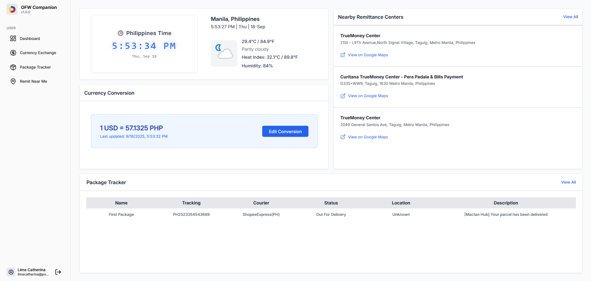
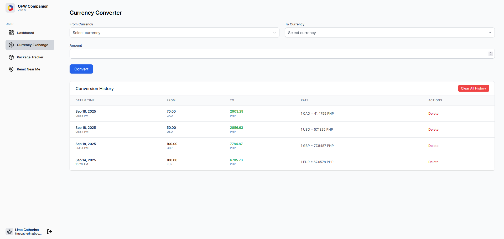
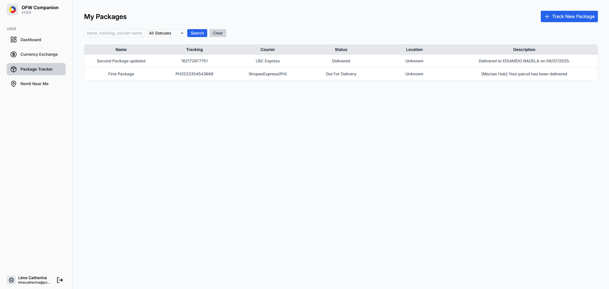
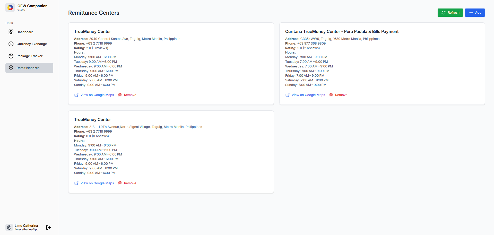
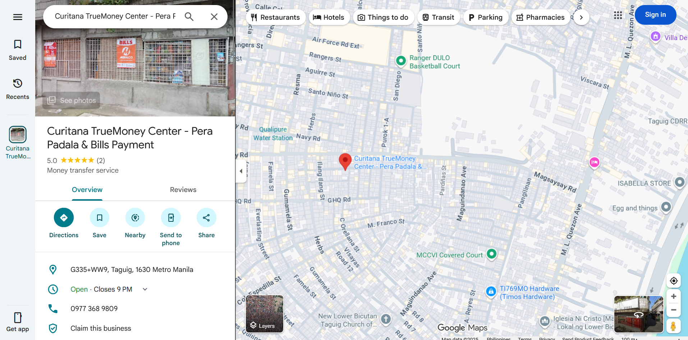

# OFW Companion 🇵🇭✈️  

**OFW Companion** is a web application designed to help Overseas Filipino Workers (OFWs) manage essential needs in one place. It provides tools for currency conversion, package tracking, and finding the nearest remittance centers, making life abroad more organized and convenient.  

---

## ✨ Features  

- **User Authentication** – Secure signup, login, and logout (using Devise).  
- **Dashboard** – Central hub showing a concise summary of all features.  
- **Currency Conversion** – Convert between currencies with live exchange rates and saved preferences.  
- **Package Tracking** – Track parcels and shipments using the 17Track API.  
- **Nearest Remittance Center** – Find remittance centers nearby with Google Maps integration.  
- **Responsive Design** – Optimized for desktop, tablet, and mobile devices.  

---

## 🛠️ Tech Stack  

- **Backend**: Ruby on Rails  
- **Frontend**: ERB, Tailwind CSS, custom components  
- **Authentication**: Devise  
- **Database**: PostgreSQL  
- **APIs**:  
  - Google Maps API (nearest remittance centers)  
  - HexaRate Currency Exchange Rate API (currency conversion)  
  - 17Track API (package tracking)  
  - PhilSMS API (sms notifications)
  - Weather API – Current Conditions (available after saving places via Google Maps API)
  
---

## 📸 Screenshots  

### 🔑 Login Page  
Easily access your account with secure login.  

  

### 📝 Registration Page  
Create an account quickly to start using the app.

  

### 📊 Dashboard  
- Shows today’s currency conversion for your chosen currency  
- Displays weather (after saving your nearest remittance center)  
- Tracks your in-transit packages 

  

### 💱 Currency Converter  
- Convert between different currencies  
- View conversion history  
- Delete history individually or clear all  

  

### 📦 Package Tracker  
- Track multiple packages from **2800+ carriers**  
- Track different carriers on one page  
- Add your name to each package for easy identification  
- Carrier auto-detection included 

  

### 🏦 Nearest Remittance Center  
- Find the nearest remittance centers  
- Save your favorites for quick access  
- Open locations in Google Maps directly  

  

  

